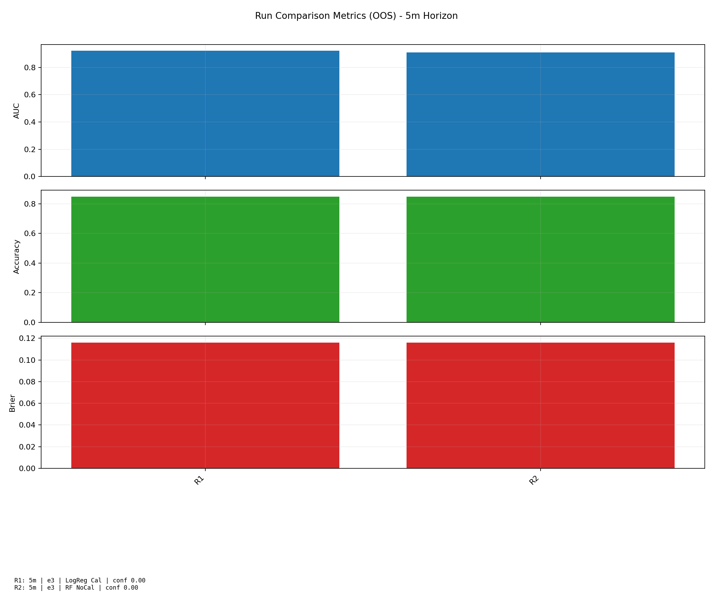
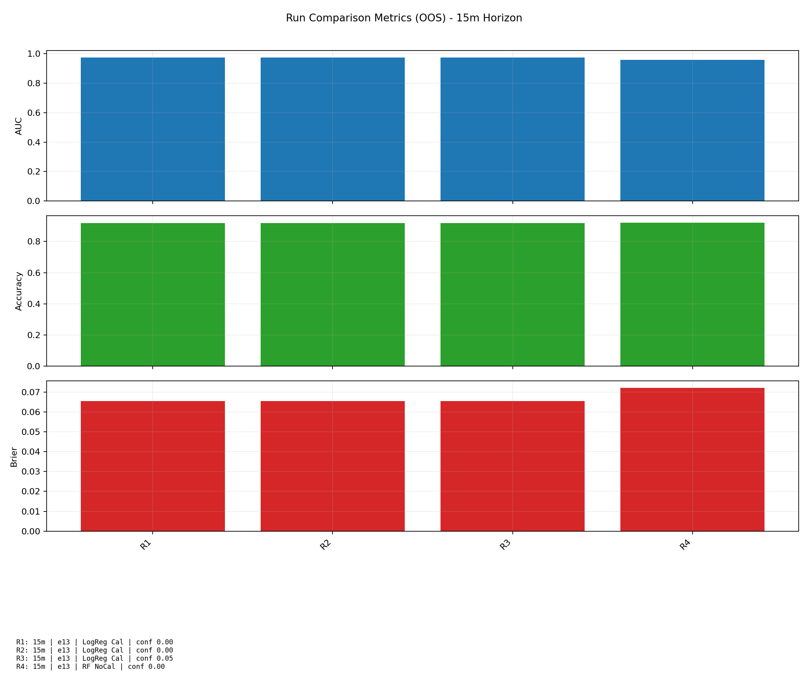

# Candle Close Predictor

Research-focused machine learning pipeline for short-horizon crypto candle classification.

This project explores whether intraperiod market information can be used to estimate directional outcomes at candle close under strict out-of-sample validation.

## Why This Project

Most trading experiments fail because of leakage, weak evaluation design, or overfitting to noise.  
This repository is structured to prioritize:

- Temporal integrity (features only use information available at decision time)
- Walk-forward validation (rolling train/test windows)
- Honest out-of-sample reporting
- Repeatable experimentation and risk-aware analysis

## Scope

- Instruments: BTC-USD (1-minute OHLCV)
- Target horizons: 5-minute and 15-minute candles
- Task type: binary classification (up-close vs down-close)
- Modeling: baseline linear and tree-based classifiers

## Project Structure

```text
src/
  dataset.py       # data loading, normalization, bucket/label prep
  features.py      # feature frame generation at configurable entry minute
  models.py        # model factory + probability inference
  walkforward.py   # rolling OOS evaluation and reporting
  montecarlo.py    # bootstrap risk simulation for trade-return samples
  download_data.py # market data downloader
  utils.py         # shared helpers
```

## Methodology (High Level)

1. Load and normalize 1-minute OHLCV data.
2. Re-bucket into target horizon candles.
3. Snapshot each candle at a chosen entry minute.
4. Build feature vectors from information available up to that entry point.
5. Train/test via rolling walk-forward windows.
6. Evaluate OOS quality metrics and probability behavior.
7. Run bootstrap Monte Carlo on sampled trade outcomes for risk context.

## Current State

- End-to-end pipeline implemented and modularized
- Walk-forward experimentation working for both 5m and 15m horizons
- Confidence-filtered trade simulation and Monte Carlo analysis integrated
- Baseline model comparisons implemented for iterative research

## Roadmap

- Expand historical coverage and regime diversity in datasets
- Add stronger model diagnostics and probability calibration checks
- Introduce experiment tracking and run metadata logging
- Extend feature families and regime-aware filtering
- Add robustness tests across alternate assets/time windows

## Local Run

```bash
python3 -m venv .venv
source .venv/bin/activate
pip install -r requirements.txt
```

Download data:

```bash
python -m src.download_data --days 90 --source coinbase --product BTC-USD --out data/btcusd_90d.csv
```

Run walk-forward (example):

```bash
python -m src.walkforward --data data/btcusd_90d.csv --horizon 15 --entry_minute 13 --model logreg --calibrate --lookback_days 60 --test_days 14 --mc_sims 5000
python -m src.walkforward --data data/btcusd_90d.csv --horizon 5 --entry_minute 3 --model rf --lookback_days 60 --test_days 14 --mc_sims 5000
```

Run reproducible experiment grid + report:

```bash
python -m src.run_experiments --data data/btcusd_90d.csv --out_dir results/runs --horizons 15,5 --entry_minutes 13,3 --models logreg,rf --calibrate_logreg --lookback_days 60 --test_days 14 --mc_sims 5000
python -m src.report --runs_dir results/runs --out_dir results/report --mc_sims 2000
python -m src.report --runs_dir results/runs --out_dir results/report --mc_sims 2000 --inject_readme
```

Run with confidence-threshold sweep:

```bash
python -m src.run_experiments --data data/btcusd_90d.csv --out_dir results/runs --horizons 15,5 --entry_minutes 13,3 --models logreg,rf --calibrate_logreg --min_conf_values 0.0,0.02,0.05,0.1 --lookback_days 60 --test_days 14 --mc_sims 5000
python -m src.report --runs_dir results/runs --out_dir results/report --mc_sims 2000
```

Generated artifacts:

- `results/runs/<run_id>/config.json`
- `results/runs/<run_id>/summary.json`
- `results/runs/<run_id>/fold_metrics.csv`
- `results/runs/<run_id>/predictions.csv`
- `results/report/summary_table.csv`
- `results/report/key_findings.md` (README-ready summary block)
- `results/report/overall_metrics.png`
- `results/report/confidence_tradeoff.png` (if multiple `min_conf` values are present)
- `results/report/per_run/<run_id>/*.png`
- `results/report/snapshots/*.png` (stable filenames for README embedding)

## Results Snapshot

Representative visuals (lightweight view) are generated into `results/report/snapshots/`.




### Chart Key (Plain English)

- `AUC`: How well the model separates green vs red candles. Higher is better.
- `Accuracy`: Percent of correct direction calls. Higher is better.
- `Brier`: How far predicted probabilities are from actual outcomes. Lower is better.
- `Take rate`: Percent of candles that pass the confidence filter and become trades.

Detailed visuals (calibration, fold metrics, Monte Carlo distribution, equity/drawdown) stay in:
- `results/report/per_run/<run_id>/`

## Key Findings

<!-- AUTO_KEY_FINDINGS_START -->
Updated automatically from `results/report/summary_table.csv`.

Metric guide:
- `AUC`: how well the model separates up vs down candles (higher is better).
- `Accuracy`: percent of correct up/down calls.
- `Brier`: probability error score (lower is better).
- `Take rate`: percent of candles where a trade is taken after filtering.

### Best Configuration

- 15-minute horizon, entry minute 13, logreg (calibrated), confidence threshold 0.0. Scores: AUC `0.9731`, Accuracy `0.9181`, Brier `0.0655`, Take rate `1.0000`.

### Best by Horizon

- `5m`: 5-minute horizon, entry minute 3, logreg (calibrated), confidence threshold 0.0. AUC `0.9230`, Accuracy `0.8481`, Brier `0.1160`.
- `15m`: 15-minute horizon, entry minute 13, logreg (calibrated), confidence threshold 0.0. AUC `0.9731`, Accuracy `0.9181`, Brier `0.0655`.

### Confidence Threshold Notes

- 15-minute, entry 13, logreg (calibrated): raising confidence threshold from `0.0` to `0.05` changed take rate by `-0.0041` and AUC by `0.0000`.

### Takeaway

- Built a reproducible, leakage-aware ML research workflow with automated OOS evaluation, risk diagnostics, and visual reporting.
- Demonstrates disciplined experimentation and model comparison across horizons and confidence filters.
<!-- AUTO_KEY_FINDINGS_END -->

## Portfolio Notes

This repository is intentionally public-safe.  
It demonstrates research process, engineering rigor, and evaluation discipline without publishing private strategy details, proprietary tuning decisions, or deployment logic.

## Disclaimer

This is a research project, not financial advice or a production trading system.
